# Zenynth

Zenynth is a minimal powerful Semi-Modular Synthetizer, able to generate all of the most iconic Synth's sounds.

It features infinite Synth Engines (of 4 different types), Noise generators, 3 Filter Chains, and 3 FX chains (each one made by 5 effects to choose from: Delay, Reverb, Distortion, Vibrato, Pan, and Chorus).
5 freely assignables Modulators and a main ADSR Envelope allow to shape the sound further and produce crazy noises.

  
 

# How to use it
  - Online Version [here](https://eliapirrello.github.io/zenyth/) //currently offline
  - Locallly: Clone git repo and run the following command in the project terminal:
  1. `npm install`
  2. `npm update`
  3. `npm run build` or `npm run serve` respectively for distribution or developement builds

 

Play the synth with your computer keyboard: `[a,w,s,e,d,f,t,g,y,h,u,j,k,o,l,p,ò,à]` 

Or connect a MIDI keyboard and reload the page!

(Connecting more than one MIDI/audio device could interfere with MIDI)
  
 

### OSCILLATORS

|                                                     |   |  |  |
|-----------------------------------------------------|---|---|---|
| 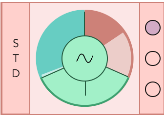  | Synth Engine: Shift+Click to remove, click "+" to add |    | Synth Engine Selector   | 
|                           |  Waveform Selector (change clicking)  |     |   Left Slider: Noise Volume | 
|                      |  Right Slider: Oscillator Volume  |    |  Synth Routing: Select filter chains clicking on the dots (more chains can be selected for each Synth Engine)  | 
|  |  Oscillator Tuning |

  
 
    
### FILTERS
Three parallel Filter Chains (Horizontal)

|   |   |                                     |  |
|---|---|-------------------------------------|---|
| 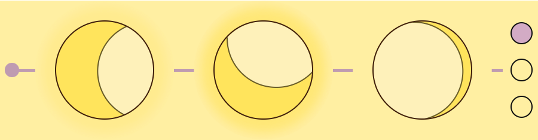|  Low Pass, Band and High Pass filters in serie | 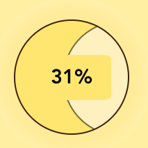  | Drag Horizonatally to change frequency, vertically to change amount and resonance |  
| 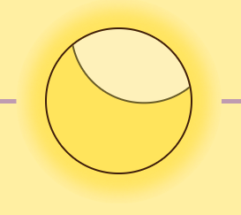|  Resonance/amount rapresented by glow around each filter |  |   Filter Routing: Select Fx Chain by clicking on the dots (more chains can be selected for each Filter Chain) |

  
 

### EFFECTS
Three parallel Fx Chains (Vertical)

|   |   |  |  |
|---|---|---|---|
| 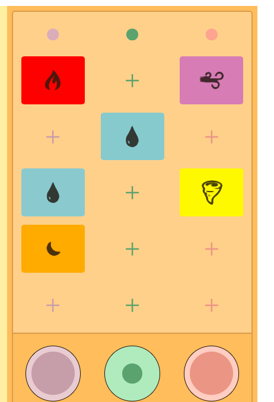| Add and swap effects clicking, change intensity by dragging vertically. Shift+Click to remove | 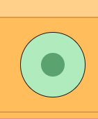| Drag vertically to change volume of the filter chain |

  
 

### MODULATORS
One main envelope, three assignable envelopes, two assignable lfos

|   |   |
|---|---|
| 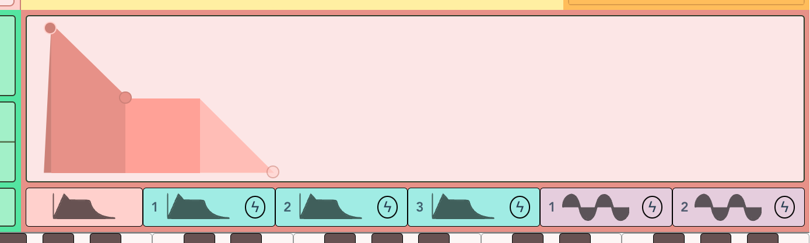 | Main Envelope: Relative to Synth Engine Volume (Draw the shape of Attack, Decay, Sustain and Release dragging the dots) |
| 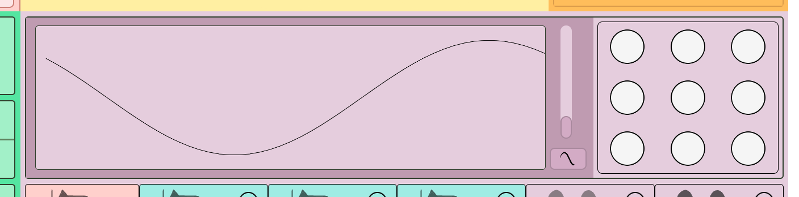 | LFO produces a periodic signal to modulate parameters. Vertical slider changes LFO speed, the button below changes waveform  |

|   |                                                          |   |                                                                                                         |
|---|----------------------------------------------------------|---|---------------------------------------------------------------------------------------------------------|
 | 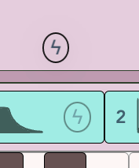 | Thunder icons are draggable                              | 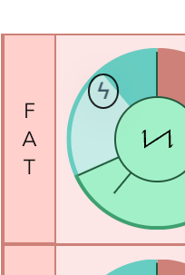 | Drop the thunder icon on: Synth Volume, Noise Volume, Synth Pitch or Filter Frequency to modulate the parameters |
|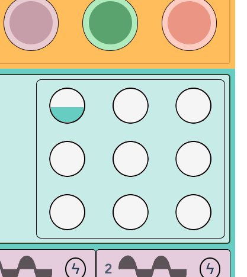 | Change modulation amount dragging the circles vertically | 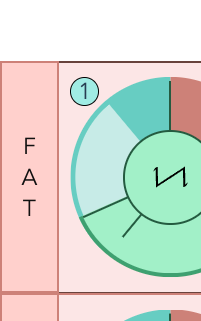 | The dot color and number indicates the modulator signal, Shift+Click on the dot to unlink the modulator |
| 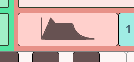 | Click mod icons to select the modulator shown            |
 
___ 

  
 

## How we built it

  
 

### Main framework and visuals:

- To achieve a simpler architecture and facilitate team cooperation, we used *Vue.js* as our main framework. The resulting graphical interface is a composition of custom Vue components, nested one into each other.
- All visual effects are realized in plain CSS, without any other library.
- The whole application is completely resizable, with a fixed aspect ratio and dimensions relative to the window's width.

  
 

### Audio Core:

- Tone.js was our initial choice to write the audio logic. As the code kept growing, the complexity increased too and the stock Tone objects weren't sufficient. We decided to wrap our main audio engines in more sophisticated and modular custom objects:
    - **MyPolySynth** - A polyphonic, multi-engine synthesizer with 6 modulator signals and a noise generator included in each voice. Each MyPolySynth can be initialized with a custom number of voices and a defined destination.
    - **MyFilter** - A multi-type filter (HP, BAND, LP), based on Tone.Filter, with the addition of 1 envelope and 1 LFO to modulate the cutoff frequency.
    - **MyFx** - A multi-Fx object, unifying 6 Tone effects in a single component.
    
     
- Thanks to these wrappers, it's now possible to modulate synth pitch, synth volume, noise volume, and filter cutoff using both LFOs and envelopes. Simply set the modulation parameters and amount.
- Further updates aim to substitute Tone with the plain WebAudioAPI to improve latency and optimize the code further.

    &rarr; _[Audio Core Detailed Scheme](./res/Zenyth_Audio_Core.pdf)_

  
 

## Dependencies
- [Tone.js](https://tonejs.github.io) - Web Audio Framework
- [Vue.js](https://vuejs.org) - Web UI Framework
- [npm](https://www.npmjs.com/) - Package Manager

 

## Team
- Colombo Marco Furio - Routing, MyFx, Animated Graphics - `marcofurio.colombo@polimi.it`
- Guglielmo Fratticioli - Front End Developement and UI Design - `guglielmo.fratticioli@mail.polimi.it`
- Elia Pirrello - Audio Core Coding and Project Management - `elia.pirrello@mail.polimi.it`

